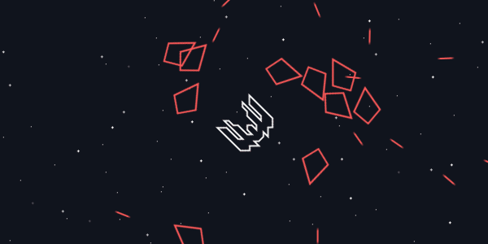

# Canvas Bullet Hell Example

An example [HTML5 Canvas](https://developer.mozilla.org/en-US/docs/Web/API/Canvas_API) game built with a custom engine influenced by [Phaser](https://github.com/photonstorm/phaser/), [Pixi](https://github.com/pixijs/pixi.js/), [Angular](http://angular.io/), [React](https://facebook.github.io/react/) and [Three](http://threejs.org/) libraries.

This was developed in TypeScript, a superset of javascript with beta features built in along with Types for [intelisense](https://msdn.microsoft.com/en-us/library/hcw1s69b.aspx) (autocomplete).

## Getting Started

Download [Gitub Atom](https://atom.io/) and download the [TypeScript plugin](https://atom.io/packages/atom-typescript) by pressing `Ctrl + Shift + P` and typing in `Install Packages and Themes`, and search for `TypeScript` in the search bar.

Make sure you have node installed, and then just `node server.js` and open up `localhost:3000` on your browser!

```javascript
import {Renderer} from './lib/renderer';

import {Back} from './menu/back';
import {Menu} from './menu/menu';
import {Player} from './ships/player';
import {Enemy} from './ships/enemy';

var renderer;

function start() {
  renderer = new Renderer();
  document.getElementById('game').appendChild(renderer.canvas);
}

function createScene() {
  //Create an initial scene.
}

function animate() {
  renderer.update();
  renderer.render();
  requestAnimationFrame(animate);
}

start();
createScene();
animate();
```

## Docs


### Spawning


## Design decisions

1. Every GameObject is responsible for handling how it is rendered. This *can be dangerous since you're in control of the draw stack* so most libraries would add helper methods you can use that then reference a given context, however this gives you more control. Every GameObject is drawn in the order it has been added. In the future rendering can be influenced by the depth value of an object, then it's call order.

2. GameObjects have optional dependencies injected into them in the form of Scene and Input singletons. This would be better with `@decorators` to inject dependencies as you need them. Another approach could be signal based, for example a `GameObject.destroy()` abstract method, sends a signal up to the scene node to destroy its reference (Phaser does this), rather than the GameObject referencing the scene and calling `scene.destroy(this)`.

3. GameObjects could be made of components like [Angular](https://angular.io/docs/ts/latest/api/core/Component-decorator.html), [Unity](http://docs.unity3d.com/ScriptReference/Component.html) and [Unreal](https://docs.unrealengine.com/latest/INT/Programming/UnrealArchitecture/Actors/Components/index.html), and these components would be responsible for rendering, movement, physics, etc. If they need to communicate between each other it would be easy to make references to each of them.

4. Input function names are modeled after the [Unity Game Engine](http://unity3d.com/), however the code is modeled after the [official javascript spec](https://developer.mozilla.org/en-US/docs/Web/API/KeyboardEvent/keyCode), a polyfill of the new draft of `KeyboardEvent.code`. Keyboard Events are still very fragmented, so this `KeyboardEvent.code` tried to unite them across browsers. Keys are mapped to a JavaScript object. This could perform faster if you used another data structure (Set, Int32Array). This could also become full of garbage data after a while.

5. Vectors don't have operators. Depending on the glMatrix.js library or something similar would be better for the future.

6. Rendering is coupled to Canvas. In the future, this could be injectable, so you can choose your renderer, an abstact one, or one closer to the metal.

## Appendix

 * [Keith Clark's Space Defender Game](http://keithclark.co.uk/articles/js1k-2015-defender/) - A canvas side scrolling space fighting game reminiscent of old games like [pixelships](http://www.pixelships.com/).

 * [Andrea Venuta's Endless Wireframe Tunnel Run](http://veeenu.github.io/2014/04/07/js1k-2014-post-mortem.html) - A WebGL endless tunnel reminiscent of games like [Super Hexagon](http://superhexagon.com/).

 * [Jeff Thomas's Gravity Cloud](http://codepen.io/aecend/pen/rabgvq) - A little game where thousands of particles follow your mouse.
